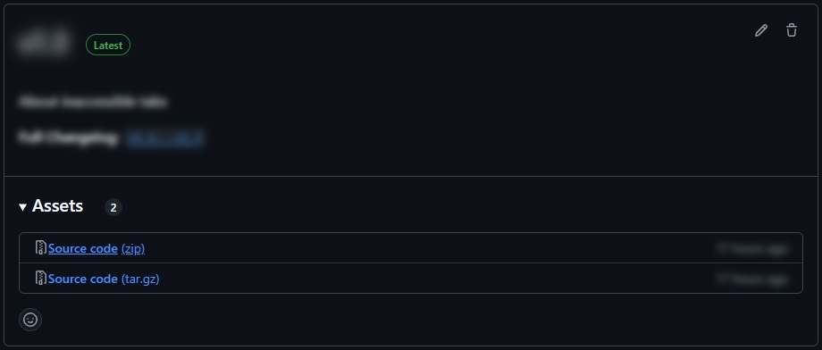
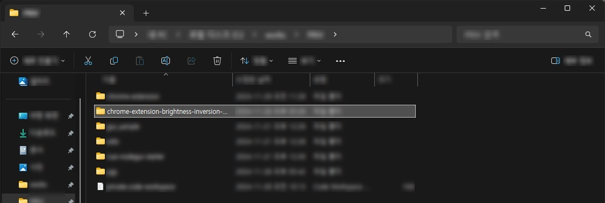
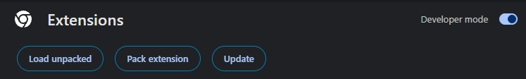

# Sjegink's Brightness Inversion

## Introduce

You can apply brightness inversion separately for each tab.

## Get Started

1. Get this extension

    1. Download a [latest release](https://github.com/sjegink/chrome-extension/releases).

		

    1. Unzip it and get just one folder.
	
		

1. Import the folder into your chromium browser.

	1. Enter [<svg height=1rem fill="currentColor" xmlns="http://www.w3.org/2000/svg" viewBox="0 0 512 512"><!--!Font Awesome Free 6.7.1 by @fontawesome - https://fontawesome.com License - https://fontawesome.com/license/free Copyright 2024 Fonticons, Inc.--><path d="M192 104.8c0-9.2-5.8-17.3-13.2-22.8C167.2 73.3 160 61.3 160 48c0-26.5 28.7-48 64-48s64 21.5 64 48c0 13.3-7.2 25.3-18.8 34c-7.4 5.5-13.2 13.6-13.2 22.8c0 12.8 10.4 23.2 23.2 23.2l56.8 0c26.5 0 48 21.5 48 48l0 56.8c0 12.8 10.4 23.2 23.2 23.2c9.2 0 17.3-5.8 22.8-13.2c8.7-11.6 20.7-18.8 34-18.8c26.5 0 48 28.7 48 64s-21.5 64-48 64c-13.3 0-25.3-7.2-34-18.8c-5.5-7.4-13.6-13.2-22.8-13.2c-12.8 0-23.2 10.4-23.2 23.2L384 464c0 26.5-21.5 48-48 48l-56.8 0c-12.8 0-23.2-10.4-23.2-23.2c0-9.2 5.8-17.3 13.2-22.8c11.6-8.7 18.8-20.7 18.8-34c0-26.5-28.7-48-64-48s-64 21.5-64 48c0 13.3 7.2 25.3 18.8 34c7.4 5.5 13.2 13.6 13.2 22.8c0 12.8-10.4 23.2-23.2 23.2L48 512c-26.5 0-48-21.5-48-48L0 343.2C0 330.4 10.4 320 23.2 320c9.2 0 17.3 5.8 22.8 13.2C54.7 344.8 66.7 352 80 352c26.5 0 48-28.7 48-64s-21.5-64-48-64c-13.3 0-25.3 7.2-34 18.8C40.5 250.2 32.4 256 23.2 256C10.4 256 0 245.6 0 232.8L0 176c0-26.5 21.5-48 48-48l120.8 0c12.8 0 23.2-10.4 23.2-23.2z"/></svg> Extensions](chrome://extensions/) in Menu <i style="display:inline-flex; border:1px solid; border-radius:.5rem; width:1.35rem; height:1.35rem; align-items:center; justify-content: center;"><svg height=1rem fill="currentColor" xmlns="http://www.w3.org/2000/svg" viewBox="0 0 128 512"><!--!Font Awesome Free 6.7.1 by @fontawesome - https://fontawesome.com License - https://fontawesome.com/license/free Copyright 2024 Fonticons, Inc.--><path d="M64 360a56 56 0 1 0 0 112 56 56 0 1 0 0-112zm0-160a56 56 0 1 0 0 112 56 56 0 1 0 0-112zM120 96A56 56 0 1 0 8 96a56 56 0 1 0 112 0z"/></svg></i>
	
		

	1. Toggle **Developer mode <svg height=1rem fill="currentColor" xmlns="http://www.w3.org/2000/svg" viewBox="0 0 576 512"><!--!Font Awesome Free 6.7.1 by @fontawesome - https://fontawesome.com License - https://fontawesome.com/license/free Copyright 2024 Fonticons, Inc.--><path d="M384 128c70.7 0 128 57.3 128 128s-57.3 128-128 128l-192 0c-70.7 0-128-57.3-128-128s57.3-128 128-128l192 0zM576 256c0-106-86-192-192-192L192 64C86 64 0 150 0 256S86 448 192 448l192 0c106 0 192-86 192-192zM192 352a96 96 0 1 0 0-192 96 96 0 1 0 0 192z"/></svg>** On

	1. Press <strong style="display:inline-block; border:1px solid; padding:0 .5em; border-radius:1em;">Load unpacked</strong> to find and select the folder you downloaded.
	
		

1. If get any issues, please let me know in [⊙ Issues](https://github.com/sjegink/chrome-extension/issues)!